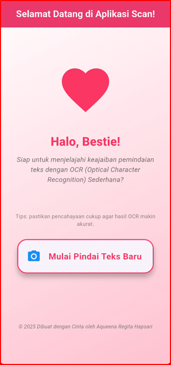
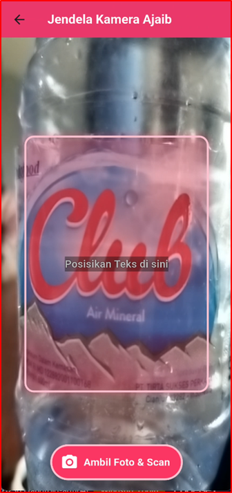
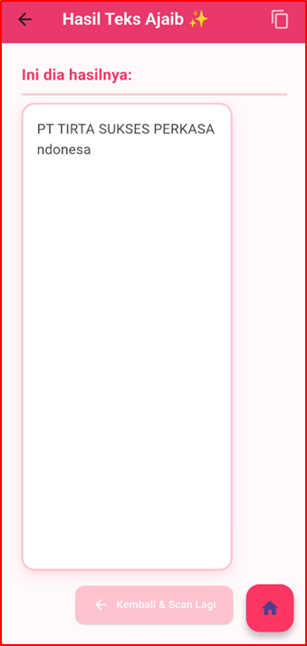
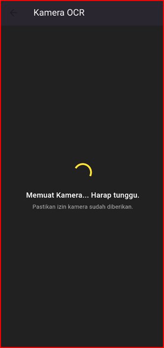
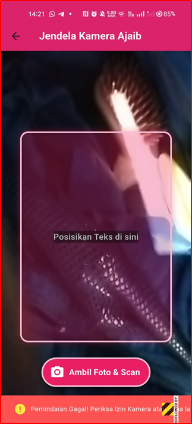
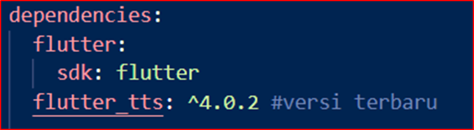
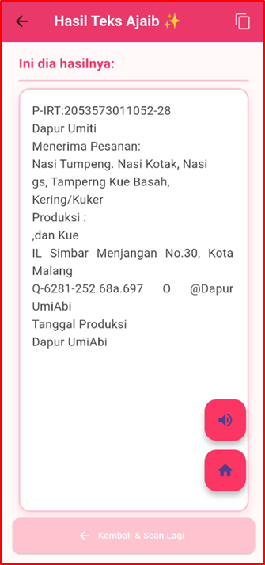

<div align="center">

  <h1>💗 Aplikasi OCR Sederhana dengan Flutter 🌸</h1>

  <p><em>Implementasi Jobsheet 7 — Optical Character Recognition (OCR) Sederhana</em></p>

  <p><strong>🎀 Identitas Mahasiswa</strong></p>
  <p>
    <strong>Mata Kuliah:</strong> Pemrograman Mobile<br>
    <strong>Dosen Pengampu:</strong> Ade Ismail, S.Kom., M.TI<br>
    <strong>Nama:</strong> Aqueena Regita Hapsari<br>
    <strong>NIM:</strong> 2341760096<br>
    <strong>Kelas:</strong> SIB 3C<br>
    <strong>No Absen:</strong> 06
  </p>

  
  
  
  
  
  
  
  

</div>

---

## 🎯 Tujuan Praktikum

Setelah menyelesaikan praktikum ini, mahasiswa mampu:
- Membuat aplikasi Flutter multi-halaman.  
- Menggunakan plugin kamera untuk mengambil gambar.  
- Mengintegrasikan **OCR (Optical Character Recognition)** menggunakan library `google_mlkit_text_recognition`.  
- Menampilkan hasil OCR di halaman hasil.  
- Menerapkan navigasi dasar antar layar menggunakan `Navigator`.

---

## 🧰 Alat dan Bahan
- Laptop/komputer dengan Flutter SDK terinstal  
- VS Code atau Android Studio  
- Emulator Android atau perangkat fisik  
- Koneksi internet (untuk instalasi dependensi)  

---

## ⚙️ Langkah Kerja (Ringkasan)
1. **Membuat Proyek Baru**
   ```bash
   flutter create ocr_sederhana
   cd ocr_sederhana
   ```
2. **Menambahkan Plugin**
   Tambahkan dependensi berikut ke `pubspec.yaml`:
   ```yaml
   dependencies:
     google_mlkit_text_recognition: ^0.15.0
     camera: ^0.11.2
     path_provider: ^2.1.2
     path: ^1.8.3
   ```
   lalu jalankan:
   ```bash
   flutter pub get
   ```
3. **Menambahkan Izin Kamera (Android)**
   Tambahkan di `AndroidManifest.xml` sebelum `<application>`:
   ```xml
   <uses-permission android:name="android.permission.CAMERA" />
   ```
4. **Membuat Struktur Folder**
   ```
   lib/
   ├── main.dart
   └── screens/
       ├── splash_screen.dart
       ├── home_screen.dart
       ├── scan_screen.dart
       └── result_screen.dart
   ```

---

## 💗 Dokumentasi Aplikasi

| No | Tampilan | Deskripsi |
|:--:|:---------:|:----------|
| 1 |  | **Halaman Utama:** Tampilan pembuka dengan tema pink pastel dan tombol *Mulai Scan Teks*. Tombol ini akan mengarahkan pengguna menuju kamera untuk melakukan proses pemindaian teks.
| 2 |  | **Panduan Pemindaian:** Tampilan kamera dengan instruksi posisi teks agar hasil pemindaian lebih akurat. Pengguna diarahkan untuk menyesuaikan teks di dalam area bidik kamera. |
| 3 |  | **Proses Pengenalan Teks:** Saat tombol *Ambil Foto & Scan* ditekan, sistem menampilkan indikator loading sebagai tanda proses OCR sedang berjalan. |
| 4 |  | **Hasil Pembacaan Teks:** Jika gambar jelas dan teks dapat dikenali, hasil OCR akan ditampilkan di halaman hasil. Pengguna dapat melihat dan menyalin teks tersebut. |
| 5 |  | **Fitur Salin Teks:** Menunjukkan keberhasilan pengguna dalam menyalin hasil teks dari OCR. Fitur ini mempermudah penggunaan hasil pemindaian ke aplikasi lain. |
| 6 |  | **Gagal Membaca Teks:** Jika gambar buram atau teks tidak terbaca, aplikasi akan menampilkan pesan *“Tidak ada teks ditemukan.”* sebagai notifikasi. |

---

## 📋 Tugas Praktikum & Jawaban

### a. Apakah semua teks terbaca dengan akurat? Mengapa?

Tidak semua teks terbaca dengan akurat.  
Akurasi pembacaan OCR dipengaruhi oleh beberapa faktor seperti **pencahayaan**, **kualitas kamera**, **ketajaman fokus**, dan **jenis font** pada teks.  
Teks dengan pencahayaan yang baik dan font standar terbaca jelas, sedangkan teks miring, blur, atau berlatar warna sering kali gagal terbaca.

---

### b. Apa kegunaan fitur OCR dalam kehidupan sehari-hari?

Fitur OCR (Optical Character Recognition) berguna untuk **mengubah teks cetak menjadi teks digital** tanpa perlu mengetik ulang.  
Dalam kehidupan sehari-hari, OCR membantu:
- Mempercepat input data dari dokumen kertas.  
- Meningkatkan efisiensi kerja administrasi atau penelitian.  
- Membantu penyandang disabilitas dengan pembacaan teks otomatis.  
- Mempermudah penerjemahan teks dari kamera secara langsung.

---

### c. Sebutkan 2 contoh aplikasi nyata yang menggunakan OCR!

1. **Google Lens** — memungkinkan pengguna menyalin dan menerjemahkan teks dari gambar atau kamera.  
2. **CamScanner** — memindai dokumen dan mengenali teks untuk diubah menjadi format digital (PDF/TXT).  
3. **PhotoMath** — menggunakan OCR untuk mengenali persamaan matematika dan menampilkan langkah penyelesaiannya.

---
 <div align = center>
  <h1>🌸 Lanjutan Praktikum — Ujian Tengah Semester (UTS) Flutter OCR Sederhana 💗</h1>
 </div>

> Pengembangan lanjutan dari aplikasi “OCR Sederhana” dengan fitur navigasi, custom loading, penanganan error, serta integrasi **Text-to-Speech (TTS)** menggunakan `flutter_tts`.  
> Semua pembaruan disesuaikan dengan arahan pada **Lembar Kerja UTS** 🌷  

---

### 🧁 1. Pengubahan Navigasi Home (Soal 1)



✨ **Deskripsi:**
- Tombol *Mulai Scan Teks* kini diubah menjadi `ListTile` agar tampak lebih modern dan lembut.  
- Menggunakan ikon kamera 💙 berwarna biru dengan teks **“Mulai Pindai Teks Baru”**.  
- Tetap mempertahankan tema **pink pastel** untuk konsistensi antarmuka.  
- Fungsi navigasi menuju `ScanScreen` tetap menggunakan `Navigator.push()`.

---

### 🍓 2. Teks Utuh dan Navigasi Balik (Soal 1 Lanjutan)

  


💡 **Deskripsi:**
- Hasil pemindaian OCR kini menampilkan teks **utuh dengan baris baru (\n)** sesuai format aslinya.  
- Dihapus fungsi `replaceAll()` agar hasil tampilan lebih natural.  
- Ditambahkan **FAB Home 🏠** menggunakan `Navigator.pushAndRemoveUntil()` untuk kembali langsung ke halaman utama.  
- Pengguna dapat kembali ke beranda tanpa menekan tombol “kembali” berulang kali.

---

### 🍰 3. Custom Loading Screen di ScanScreen (Soal 2.1)



🌷 **Deskripsi:**
- Saat kamera belum siap, aplikasi menampilkan halaman loading bertema **dark pink–grey** yang anggun.  
- Elemen tampilan meliputi:
  - Latar belakang: `Colors.grey[900]`  
  - Loading indicator: `CircularProgressIndicator(color: Colors.yellow)`  
  - Teks informatif: *“Memuat Kamera... Harap tunggu.”*  
- Tujuannya memberikan kesan ramah, profesional, sekaligus menjaga estetika girly khas aplikasi ini.

---

### 🍡 4. Spesifikasi Pesan Error (Soal 2.2)



💬 **Deskripsi:**
- Blok `catch (e)` di `_takePictureAndScan()` telah dimodifikasi sesuai arahan dosen.  
- Pesan yang muncul kini bersifat informatif dan lembut:
  > *“Pemindaian Gagal! Periksa Izin Kamera atau coba lagi.”*  
- Pengguna diberi arahan tanpa menampilkan detail teknis error.  
- SnackBar ditampilkan dengan warna merah lembut (`Colors.redAccent`) agar tetap serasi dengan tema pink aplikasi.

---

### 🪞 5. Instalasi Plugin FlutterTTS (Soal 3.1)



🎀 **Deskripsi:**
- Ditambahkan plugin `flutter_tts` ke dalam file `pubspec.yaml` menggunakan versi terbaru yang kompatibel.  
- Setelah instalasi, dijalankan perintah `flutter pub get`.  
- Plugin ini digunakan untuk memberikan fitur **Text-to-Speech (TTS)** sehingga teks hasil OCR dapat dibacakan secara otomatis.

---

### 🎧 6. Konversi Widget dan Inisialisasi TTS (Soal 3.2)

- `ResultScreen` kini diubah dari `StatelessWidget` menjadi **`StatefulWidget`** agar dapat menampung instance `FlutterTts`.  
- Pada fungsi `initState()`, dilakukan inisialisasi:
  - Bahasa: `id-ID` (Bahasa Indonesia 🇮🇩)  
  - Kecepatan: `0.45`  
  - Pitch: `1.0`  
- Fungsi `dispose()` dipakai untuk menghentikan mesin TTS agar tidak tetap berjalan di background.

---

### 🔊 7. Fungsionalitas Pembacaan (Soal 3.3)



🌸 **Deskripsi:**
- Ditambahkan **FloatingActionButton (FAB)** dengan ikon **🔊 Volume Up** di kanan bawah.  
- Saat tombol ditekan, fungsi `speak()` dipanggil untuk **membacakan teks hasil OCR secara lisan**.  
- FAB Volume dan FAB Home disusun **vertikal** agar tidak saling menutupi.  
- Fitur ini meningkatkan **aksesibilitas**, cocok untuk pengguna dengan kebutuhan khusus atau untuk mempermudah pengecekan hasil OCR.

---

## 💗 Ringkasan Commit Pengerjaan UTS

| Soal | File yang Dimodifikasi | Pesan Commit |
|:----:|:----------------------|:-------------|
| 1 | `home_screen.dart`, `result_screen.dart` | `UTS: Soal 1 – ListTile & Navigasi Balik` |
| 2 | `scan_screen.dart` | `UTS: Soal 2 – Custom Loading & Error Message` |
| 3 | `pubspec.yaml`, `result_screen.dart` | `UTS: Soal 3 – Flutter TTS + FAB Volume Speak()` |

---

## 📸 Dokumentasi Tambahan UTS

| No | Screenshot | Keterangan |
|:--:|:------------|:-----------|
| 1 |  | **Soal 1:** Pengubahan Navigasi Home |
| 2 |  | **Soal 1:** Teks Utuh dan Navigasi Balik (FAB Home) |
| 3 |  | Tampilan hasil OCR utuh sesuai format baris |
| 4 |  | **Soal 2:** Custom Loading Screen di ScanScreen |
| 5 |  | **Soal 2:** Spesifikasi Pesan Error |
| 6 |  | **Soal 3:** Instalasi Plugin flutter_tts |
| 7 |  | **Soal 3:** FAB Volume untuk membaca hasil OCR |


---

## ✨ Catatan Penting
- **Izin Kamera Wajib**  
  Pastikan izin kamera sudah diberikan di perangkat. Tanpa izin, tombol scan akan gagal dan aplikasi menampilkan pesan:
  **“Pemindaian Gagal! Periksa Izin Kamera atau coba lagi.”**

- **Custom Loading Camera (Soal 2.1)**  
  Saat kamera sedang inisialisasi, aplikasi menampilkan layar loading gelap dengan indikator kuning dan teks  
  **“Memuat Kamera... Harap tunggu.”** — ini normal hingga kamera siap.

- **OCR ML Kit — Offline (dengan catatan)**  
  `google_mlkit_text_recognition` berjalan **on-device** (offline).  
  Pada sebagian perangkat, **model dapat diunduh sekali** saat pertama kali dipakai (butuh internet sebentar). Setelah itu prosesnya offline.

- **Text-to-Speech (TTS) (Soal 3)**  
  - Pastikan **volume media** tidak mute dan **engine TTS** aktif (contoh: *Google Text-to-Speech*).  
  - Bahasa diset ke **"id-ID"**; bila suara tidak keluar di beberapa device, coba ganti sementara ke **"en-US"** untuk uji, lalu kembalikan ke **"id-ID"**.  
  - Tombol **🔊 (volume up)** akan membacakan **seluruh teks OCR** yang tampil.

- **Navigasi Balik (Soal 1.2)**  
  FAB **Home** menggunakan `Navigator.pushAndRemoveUntil(...)` agar kembali **langsung ke beranda** (riwayat halaman dibersihkan).

- **Pesan Error Standar (Soal 2.2)**  
  Kita menyembunyikan detail teknis error dan hanya menampilkan pesan ramah:  
  **“Pemindaian Gagal! Periksa Izin Kamera atau coba lagi.”**

- **Akurasi & Performa OCR**  
  - Gunakan **pencahayaan yang cukup** dan pegang perangkat stabil.  
  - Pastikan teks **tajam** (tidak blur), **kontras** jelas, dan font tidak terlalu dekoratif.  
  - Resolusi kamera **medium** sudah optimal untuk kecepatan & akurasi; hindari foto terlalu gelap/terlalu kecil.

- **Perilaku Hasil Teks (Soal 1.2a)**  
  Hasil OCR ditampilkan **utuh sesuai baris aslinya** (karakter `\n` tidak dihapus), sehingga format paragraf tetap terjaga.

- **Tips Build & Device (Windows + Android)**  
  - Saat build di Windows: jika muncul “Building with plugins requires symlink support”, aktifkan **Developer Mode** Windows.  
  - Pada beberapa perangkat (Oppo/realme), nonaktifkan **battery optimization** untuk aplikasi agar kamera tidak dihentikan sistem.  
  - Jika menggunakan Dart terbaru dan melihat peringatan `withOpacity` deprecated, bisa ganti ke `withValues(alpha: ...)` (opsional, tidak memengaruhi fitur UTS).

---
## 🎥 Demo Interaktif Aplikasi OCR UTS 🌷

<div align="center">
  <a href="https://youtube.com/shorts/NmFNRN71O0E?feature=share" target="_blank">
    <br><br>
    
  </a>
  <p><em>✨ Klik gambar untuk menonton video demo aplikasi OCR Flutter 💗</em></p>
</div>

---

<div align="center">

💗 *Dibuat dengan penuh cinta oleh* **Aqueena Regita Hapsari** 🌸  
<em>"Let the camera read what the eyes see, beauty through code and light."</em>

</div>

---
I would greatly appreciate it if you could share your thoughts or suggestions regarding my work.
You can reach me at aqueenaregitahapsari@gmail.com
I’d be happy to connect!
