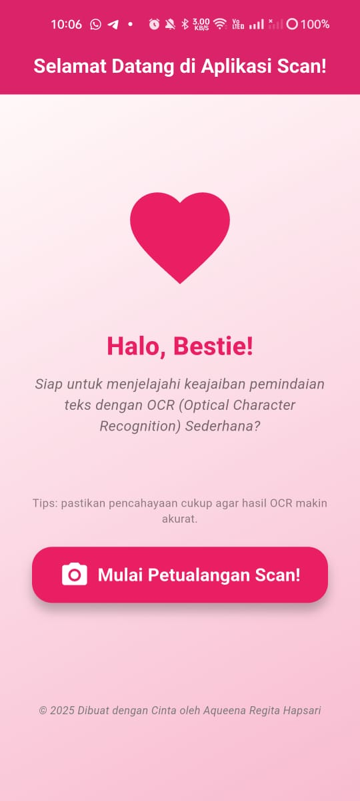
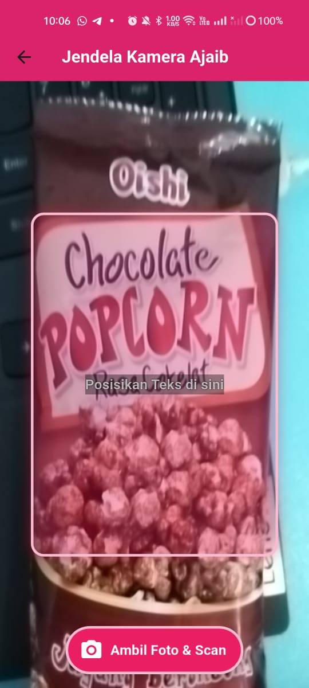
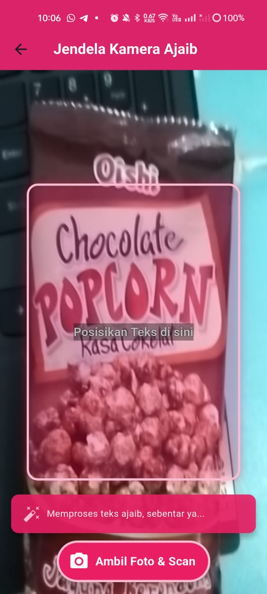
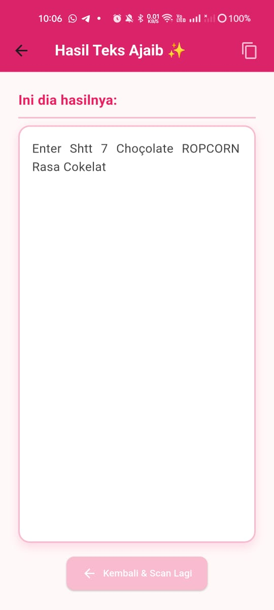
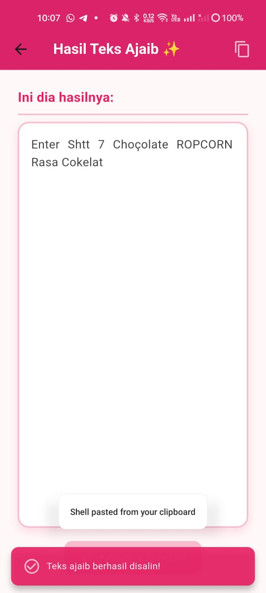
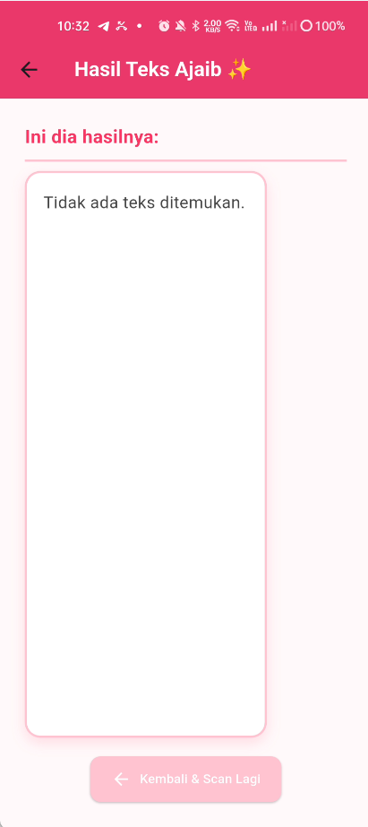

<div align="center">

  <h1>💗 Aplikasi OCR Sederhana dengan Flutter 🌸</h1>

  <p><em>Implementasi Jobsheet 7 — Optical Character Recognition (OCR) Sederhana</em></p>

  <p><strong>🎀 Identitas Mahasiswa</strong></p>
  <p>
    <strong>Mata Kuliah:</strong> Pemrograman Mobile<br>
    <strong>Dosen Pengampu:</strong> Ade Ismail, S.Kom., M.TI<br>
    <strong>Nama:</strong> Aqueena Regita Hapsari<br>
    <strong>NIM:</strong> 2341760096<br>
    <strong>Kelas:</strong> SIB 3C<br>
    <strong>No Absen:</strong> 06
  </p>

  
  
  
  

</div>

---

## 🎯 Tujuan Praktikum

Setelah menyelesaikan praktikum ini, mahasiswa mampu:
- Membuat aplikasi Flutter multi-halaman.  
- Menggunakan plugin kamera untuk mengambil gambar.  
- Mengintegrasikan **OCR (Optical Character Recognition)** menggunakan library `google_mlkit_text_recognition`.  
- Menampilkan hasil OCR di halaman hasil.  
- Menerapkan navigasi dasar antar layar menggunakan `Navigator`.

---

## 🧰 Alat dan Bahan
- Laptop/komputer dengan Flutter SDK terinstal  
- VS Code atau Android Studio  
- Emulator Android atau perangkat fisik  
- Koneksi internet (untuk instalasi dependensi)  

---

## ⚙️ Langkah Kerja (Ringkasan)
1. **Membuat Proyek Baru**
   ```bash
   flutter create ocr_sederhana
   cd ocr_sederhana
   ```
2. **Menambahkan Plugin**
   Tambahkan dependensi berikut ke `pubspec.yaml`:
   ```yaml
   dependencies:
     google_mlkit_text_recognition: ^0.15.0
     camera: ^0.11.2
     path_provider: ^2.1.2
     path: ^1.8.3
   ```
   lalu jalankan:
   ```bash
   flutter pub get
   ```
3. **Menambahkan Izin Kamera (Android)**
   Tambahkan di `AndroidManifest.xml` sebelum `<application>`:
   ```xml
   <uses-permission android:name="android.permission.CAMERA" />
   ```
4. **Membuat Struktur Folder**
   ```
   lib/
   ├── main.dart
   └── screens/
       ├── splash_screen.dart
       ├── home_screen.dart
       ├── scan_screen.dart
       └── result_screen.dart
   ```

---

## 💗 Dokumentasi Aplikasi

| No | Tampilan | Deskripsi |
|:--:|:---------:|:----------|
| 1 |  | **Halaman Utama:** Tampilan pembuka dengan tema pink pastel dan tombol *Mulai Scan Teks*. Tombol ini akan mengarahkan pengguna menuju kamera untuk melakukan proses pemindaian teks.
| 2 |  | **Panduan Pemindaian:** Tampilan kamera dengan instruksi posisi teks agar hasil pemindaian lebih akurat. Pengguna diarahkan untuk menyesuaikan teks di dalam area bidik kamera. |
| 3 |  | **Proses Pengenalan Teks:** Saat tombol *Ambil Foto & Scan* ditekan, sistem menampilkan indikator loading sebagai tanda proses OCR sedang berjalan. |
| 4 |  | **Hasil Pembacaan Teks:** Jika gambar jelas dan teks dapat dikenali, hasil OCR akan ditampilkan di halaman hasil. Pengguna dapat melihat dan menyalin teks tersebut. |
| 5 |  | **Fitur Salin Teks:** Menunjukkan keberhasilan pengguna dalam menyalin hasil teks dari OCR. Fitur ini mempermudah penggunaan hasil pemindaian ke aplikasi lain. |
| 6 |  | **Gagal Membaca Teks:** Jika gambar buram atau teks tidak terbaca, aplikasi akan menampilkan pesan *“Tidak ada teks ditemukan.”* sebagai notifikasi. |

---

## 📋 Tugas Praktikum & Jawaban

### a. Apakah semua teks terbaca dengan akurat? Mengapa?

Tidak semua teks terbaca dengan akurat.  
Akurasi pembacaan OCR dipengaruhi oleh beberapa faktor seperti **pencahayaan**, **kualitas kamera**, **ketajaman fokus**, dan **jenis font** pada teks.  
Teks dengan pencahayaan yang baik dan font standar terbaca jelas, sedangkan teks miring, blur, atau berlatar warna sering kali gagal terbaca.

---

### b. Apa kegunaan fitur OCR dalam kehidupan sehari-hari?

Fitur OCR (Optical Character Recognition) berguna untuk **mengubah teks cetak menjadi teks digital** tanpa perlu mengetik ulang.  
Dalam kehidupan sehari-hari, OCR membantu:
- Mempercepat input data dari dokumen kertas.  
- Meningkatkan efisiensi kerja administrasi atau penelitian.  
- Membantu penyandang disabilitas dengan pembacaan teks otomatis.  
- Mempermudah penerjemahan teks dari kamera secara langsung.

---

### c. Sebutkan 2 contoh aplikasi nyata yang menggunakan OCR!

1. **Google Lens** — memungkinkan pengguna menyalin dan menerjemahkan teks dari gambar atau kamera.  
2. **CamScanner** — memindai dokumen dan mengenali teks untuk diubah menjadi format digital (PDF/TXT).  
3. **PhotoMath** — menggunakan OCR untuk mengenali persamaan matematika dan menampilkan langkah penyelesaiannya.

---

## ✨ Catatan Penting
- Pastikan kamera berfungsi baik dan pencahayaan cukup.  
- Plugin `google_mlkit_text_recognition` bekerja **offline** dan mendukung bahasa Latin (termasuk Bahasa Indonesia).  
- Jika muncul error saat pertama kali membuka kamera, pastikan izin kamera sudah diaktifkan di pengaturan HP.


---

<div align="center">

💗 *Dibuat dengan penuh cinta oleh* **Aqueena Regita Hapsari** 🌸  
<em>"Let the camera read what the eyes see, beauty through code and light."</em>

</div>

---
I would greatly appreciate it if you could share your thoughts or suggestions regarding my work.
You can reach me at aqueenaregitahapsari@gmail.com
I’d be happy to connect!
